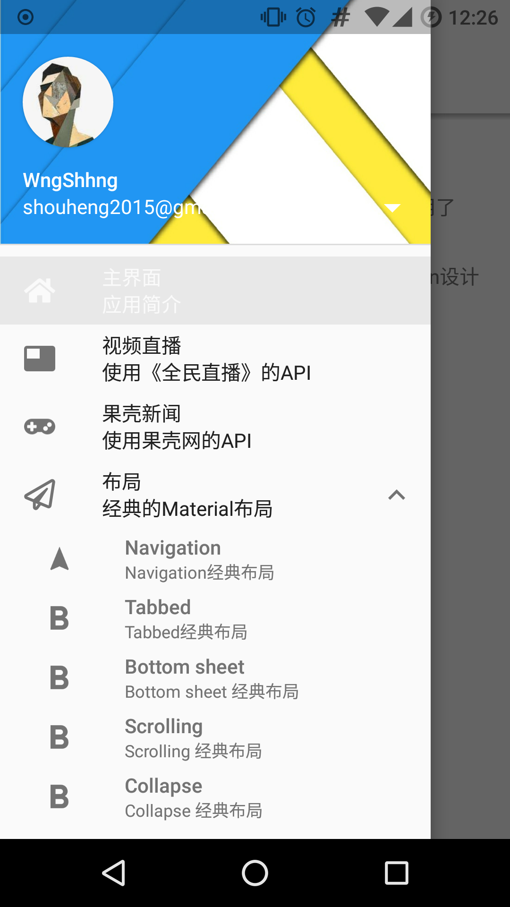
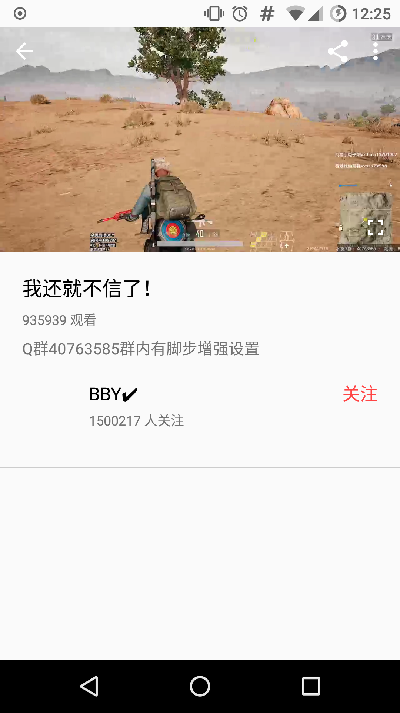
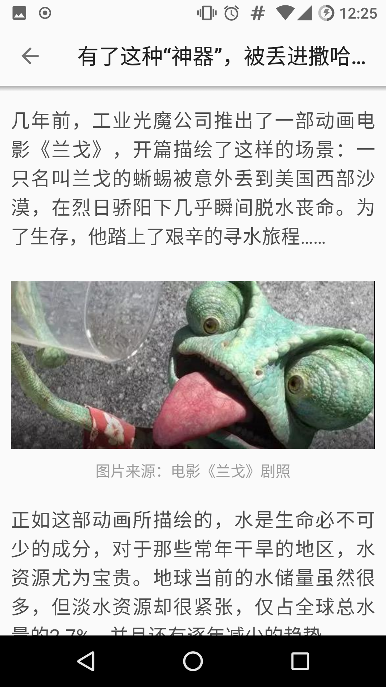
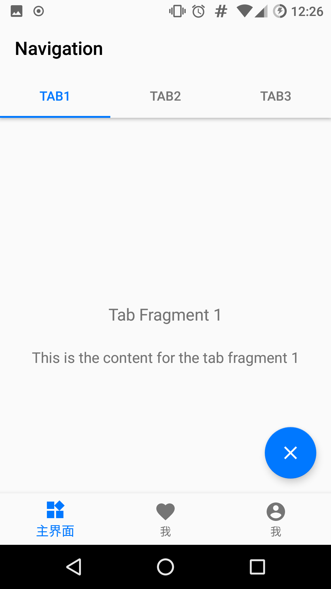
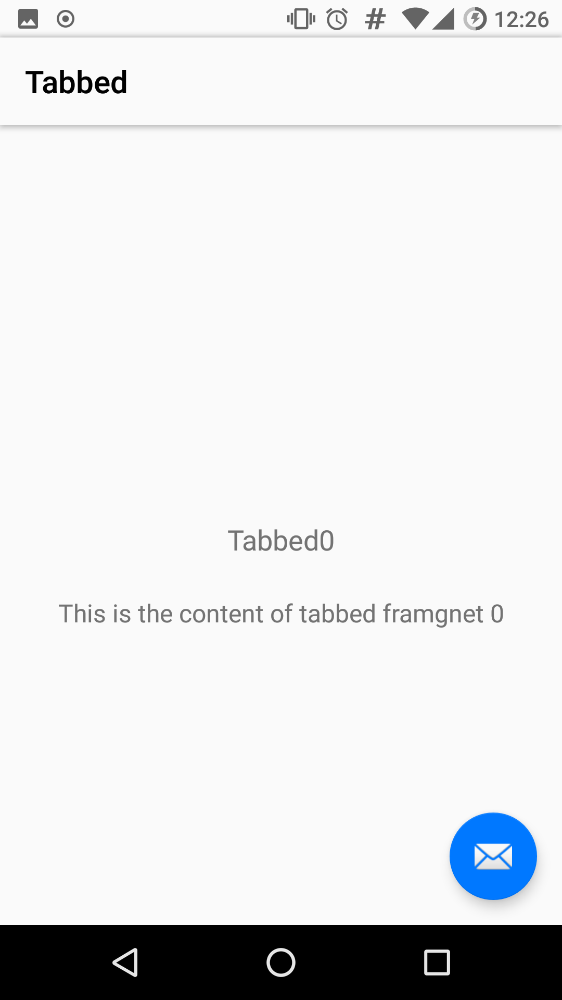
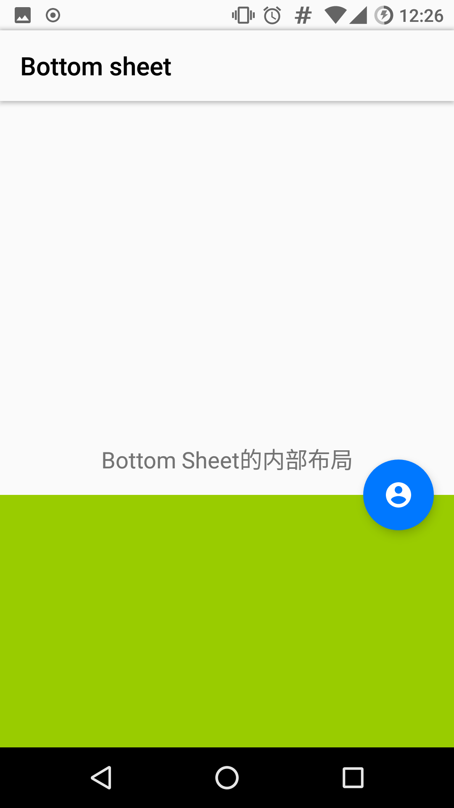
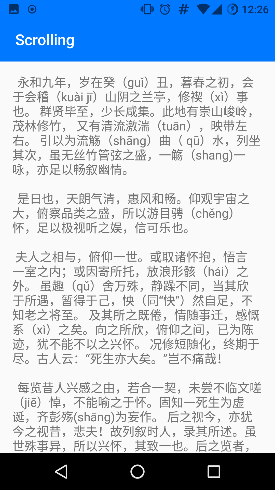
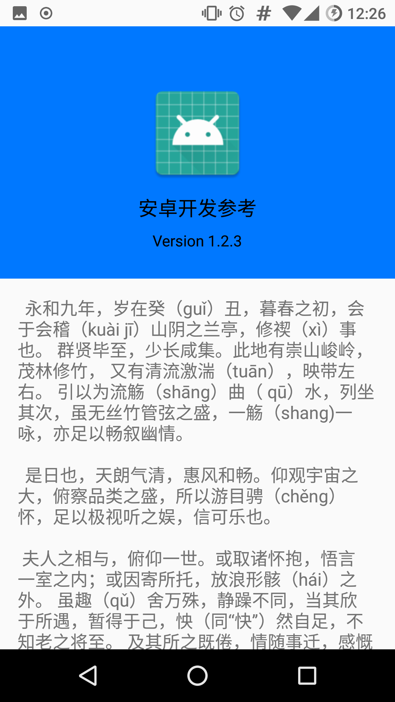

# Awesome Android

> 该项目旨在：
> 
> 1. 整理开发中经常使用到的一些三方库和控件，并将其封装为可以通用的模块；
> 2. 整理 Android 设备上经典的 Material Design 风格的布局页面；
> 3. Android 开发中的视频处理、网络接口访问的演示；
> 4. 各种不同架构设计 MVC、MVP、MVVM、组件化的演示和整理；
> 5. 更多详细的内容可以参考源码

## 下面是各个模块中的主要功能

### 模块 live：全民直播

1. 基于《全民直播》 API 设计的视频直播功能，可在线视频播放；
2. 使用了支持包里的 Palette 来提取图片的颜色；
3. MVVM 架构设计；
4. ARouter 路由；
5. 使用了pldroid-player作为视频播放的工具。

### 模块 guokr：果壳新闻

1. MVVM 架构设计；
2. 基于《果壳网》 API 设计的新闻客户端，包含基本的"列表-详情"结构；
3. ARouter 路由。

### 模块 eyepetizer：开眼视频

1. MVP 架构设计；
2. 基于《开眼视频》 API 设计视频浏览客户端；
3. ARouter 路由。

### 模块 libraries：三方库整理

1. EventBus 的使用和源码分析；
2. RxJava 的使用和源码分析；
3. ButterKnife 自做和使用，需要引用 knife-api knife-annotation knife-compile 三个模块。

## 模块 Material Design：布局整理

1. Navigation 布局
2. Tabbed 布局
3. Bottom sheet 布局
4. Scrolling 布局
5. Collapse 布局

### animations 模块

动画、Reveal 特效、Ripple 特效、提示特效的整理

